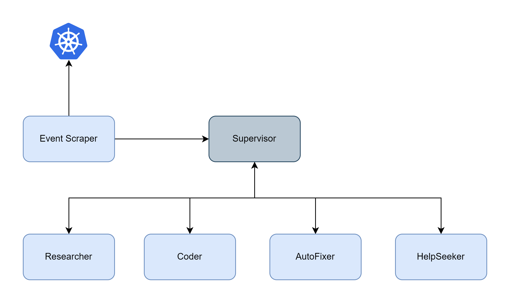

## K8s-Auto-Fixer

### Overview

**K8s-Auto-Fixer** is a supervisor-based [multi-agent](https://langchain-ai.github.io/langgraph/concepts/multi_agent/) system powered by [LangGraph](https://langchain-ai.github.io/langgraph/concepts/high_level/), that could react Kubernetes events and recover it automatically, or try to seek human intervention for help if necessary.

### Use Cases

- Correct container image typo given "Back-off" pulling image event.
- ~~Increase memory limit if container is out-of-memory.~~
- Notify system administrator via Slack when requiring human intervention.

### Features

- Multi-agent
- LangGraph
- [Tavily](https://tavily.com/)
- [Slack](https://slack.com/)

### Architecture

Multi-agent architecture breaks the system into several actors, each has its own independent scratchpads (prompt, LLM, tools...).

- **Event Scraper**: it keeps listening to Kubernetes [events](https://kubernetes.io/docs/reference/kubernetes-api/cluster-resources/event-v1/) and send any "Warning"-typed to multi-agent system.

- **[Supervisor](https://langchain-ai.github.io/langgraph/concepts/multi_agent/#supervisor-tool-calling)**: a router-like agent node decides which agent nodes should be called **next** or complete the task given a FINISH indicator.
- **Researcher**: [Tavily](https://tavily.com/) search engine optimized for LLMs and RAG, aimed at efficient, quick, and persistent search results.
- **Coder**: [PythonREPLTool](https://python.langchain.com/api_reference/experimental/tools/langchain_experimental.tools.python.tool.PythonREPLTool.html) to execute python code in a REPL (Read-Evaluate-Print Loop).
- **AutoFixer**: it generates json-patch based on received events & workload YAML manifest and executes the patch.
- **HelpSeeker**: Slack messaging webhook.



### Demo

See more in Jupyter notebook. 👈

### Implementation

See more in Jupyter notebook. 👈

### Limitation

- Sometimes OOMKilled does not reflect in both pod status & event, instead we get Error & CrashLoopBackOff which may not trigger AutoFixer in good manner...

```bash
$ kubectl get po -w
oom-pod   0/1     Pending             0               0s
oom-pod   0/1     Pending             0               0s
oom-pod   0/1     ContainerCreating   0               0s
oom-pod   0/1     Error               0               4s
oom-pod   0/1     Error               1 (4s ago)      7s
oom-pod   0/1     CrashLoopBackOff    1 (2s ago)      8s
oom-pod   0/1     Error               2 (16s ago)     22s
oom-pod   0/1     CrashLoopBackOff    2 (13s ago)     35s
oom-pod   0/1     Error               3 (27s ago)     49s
oom-pod   0/1     CrashLoopBackOff    3 (10s ago)     59s
oom-pod   0/1     Error               4 (56s ago)     105s
oom-pod   0/1     CrashLoopBackOff    4 (10s ago)     115s
```

### Operation and Maintenance

N/A

### Troubleshooting

N/A

### Q&A

N/A

### Reference

[LangGraph: Multi-Agent Workflows](https://blog.langchain.dev/langgraph-multi-agent-workflows/)

[Slack Messaging - Using incoming webhooks](https://api.slack.com/messaging/webhooks)

### TODO

- Agent-ize AutoFixer
- Sandbox-size Coder to comply with security